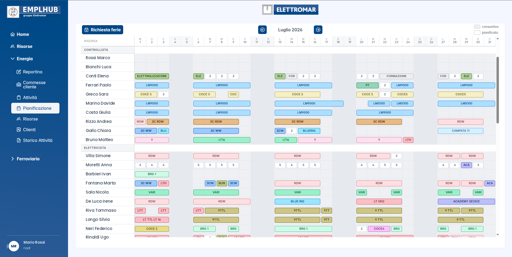
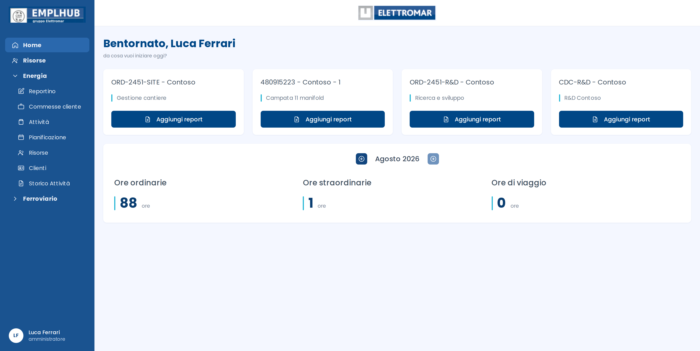
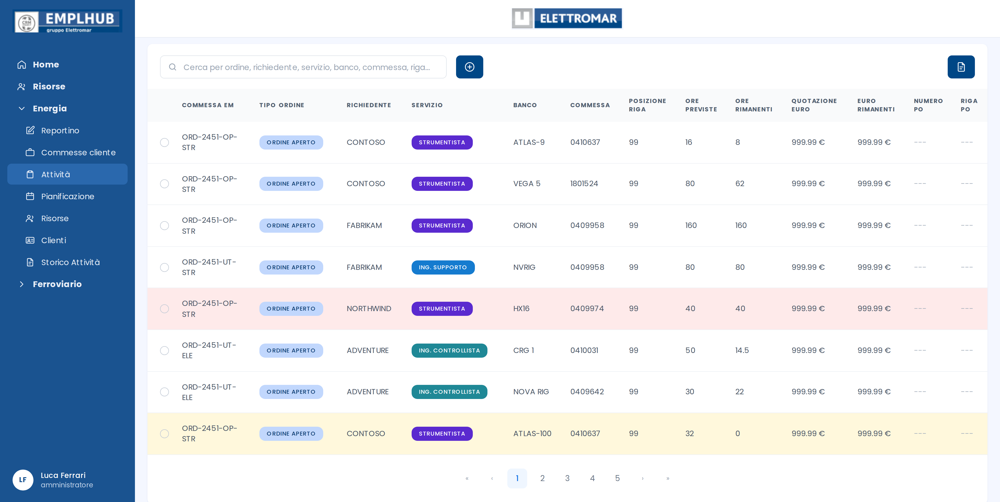

<div align="center">

# Emplhub

**Workforce management for field engineering teams.**

Time reporting, capacity planning, leave management and automated financial
reporting — built for a multi-company industrial engineering group.


</div>

> [!NOTE]
> **This repository is a showcase.** Emplhub is a private, closed-source
> application in production use. The source code is not published here.
> All names, order references and figures in the screenshots below are
> fictional.

---

## What it is

Field engineering work is hard to keep track of. Engineers move between
customer sites, log hours against dozens of concurrent work orders, take
leave that has to be approved and reflected in timesheets, and at the end of
every month somebody has to turn all of it into numbers the finance team can
actually use.

Emplhub is the internal system that does this. It replaced a stack of
spreadsheets shared over email with a single application that field staff,
team leads and administrators all work from — covering the full loop from an
engineer logging four hours on a Tuesday to a costed monthly report landing
in a director's inbox.

---

## Capacity planning

The planning board is the heart of the application: a month-wide grid where
every row is a person and every cell is a day. Past days show what was
actually reported; future days show what is planned. Leave is rendered
inline, so a team lead can see at a glance who is available next week and
who is not.



---

## Daily reporting

The landing page puts the engineer's active work orders one click away and
shows their month at a glance: ordinary hours, overtime and travel time,
navigable month by month.



---

## Work orders

Every job the group is contracted for, with quoted value, hours consumed and
budget remaining — filterable, sortable and searchable across every column
that matters.



Rows are colour-coded by budget health, so an order burning through its
quotation is visible before it becomes a problem rather than after.

---

## Feature set

| Area | What it does |
| --- | --- |
| **Time reporting** | Multi-day entry, travel hours, start/end times, validation against the work order's active window |
| **Weekly timesheets** | Auto-generated per person and week, with justifications (work, leave, public holiday), business trips, shift flags and notes |
| **Capacity planning** | Month grid combining actuals and plans, grouped by role, with inline leave |
| **Leave management** | Request, approve or reject with email notification; approving regenerates every affected weekly timesheet transactionally |
| **Monthly cost reporting** | Excel workbook per company, grouped by role with per-role subtotals, uploaded to S3 and emailed on a schedule |
| **Revenue forecasting** | Quoted versus actual cost across work orders closing in a given month, exported on demand |
| **Access control** | Role-based (root, administrator, user, customer) and scoped by company and department |

---

## Architecture

```
┌─────────────────┐         ┌──────────────────┐         ┌──────────────┐
│  React client   │  HTTPS  │  Express API     │         │  PostgreSQL  │
│  Redux Toolkit  │ ──────► │  Prisma ORM      │ ──────► │              │
│  PrimeReact     │         │  JWT auth        │         └──────────────┘
│  (Vercel)       │         │  (Railway)       │
└─────────────────┘         └────────┬─────────┘
                                     │
                         ┌───────────┼────────────┐
                         ▼           ▼            ▼
                   ┌──────────┐ ┌─────────┐ ┌──────────┐
                   │  AWS S3  │ │  SMTP   │ │   Cron   │
                   │ reports  │ │  MJML   │ │ schedule │
                   └──────────┘ └─────────┘ └──────────┘
```

**Server** — Node.js 24, TypeScript, Express, Prisma, PostgreSQL, ExcelJS,
MJML, Nodemailer, date-fns, node-schedule, deployed on Railway.

**Client** — React, TypeScript, Redux Toolkit, PrimeReact,
react-hook-form, deployed on Vercel.

**Infrastructure** — AWS S3 for generated artefacts, scheduled jobs for
monthly reporting, Dependabot and SBOM tracking for supply-chain hygiene.

---

## Engineering notes

A few problems that turned out to be more interesting than expected.

### Calendar dates are not timestamps

A timesheet entry for "12 August" is a *civil date*, not an instant. Sending
it as an ISO timestamp means a user in Athens files their Monday hours on
Sunday, and their month boundary lands a day early — a real bug, reported
from Greece and the US.

The fix was a contract enforced end to end: **civil dates travel as
`YYYY-MM-DD` strings**, never as UTC timestamps. The client builds them from
local getters; the server anchors them to `Europe/Rome` via
`Intl.DateTimeFormat`. Month ranges are half-open — `[startMonth,
endMonth)` — with the end built as the first day of the following month, so
the DST offset shift between 23:00Z in winter and 22:00Z in summer resolves
itself instead of being hardcoded.

### Long-running processes and frozen dates

A month-boundary bug had work orders silently disappearing from the client
until the server was redeployed. The cause: `startMonth` and `endMonth` were
computed once at module load. In a long-running Node process they stayed
frozen at whatever month the process had started in, and every redeploy
"fixed" it by accident.

Anything derived from the current date is now computed per request. It is an
obvious rule in hindsight and an invisible bug in practice.

### Holidays are a per-site business calendar

Public holidays come from a national dataset, filtered to genuinely
non-working days — the library also returns observances like Mother's Day,
which are not days off. The patron saint is layered on per site and cached
by `year + site`, so Follonica never inherits Florence's 24 June.

The same calendar drives both the numerator and the denominator of monthly
utilisation, which is the part that is easy to get subtly wrong: if the
hours worked exclude a holiday but the hours available do not, every ratio
is off for anyone at that site.

### Consistency across derived data

Approving a leave request is not a single write. It updates the request,
regenerates every weekly timesheet the leave overlaps — including the *old*
weeks when the dates changed, otherwise phantom leave lingers in a stale
snapshot — and notifies the employee. All of it runs in one transaction,
with the email deliberately sent **after** commit so a rollback can never
leave someone holding an approval notice for a request that was not
approved.

---

## Status

In active production use and under continuous development.

**Author** — [@riddim](https://github.com/riddim)

<div align="center">
<sub>Screenshots are from the live application with all data anonymised.</sub>
</div>
